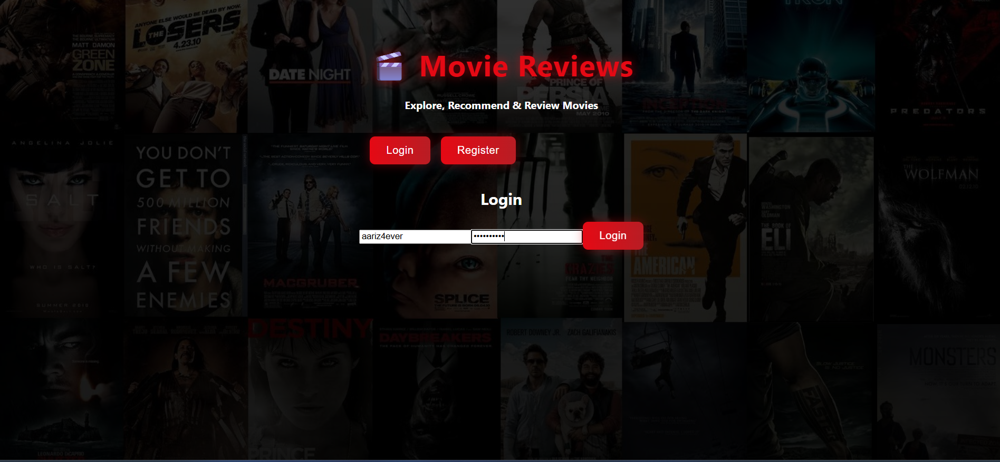
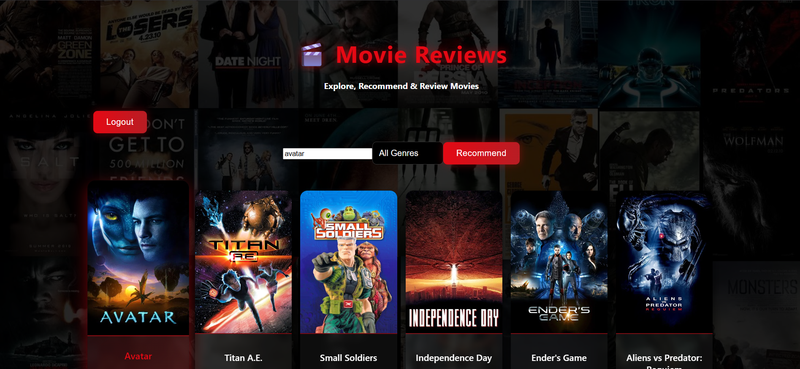
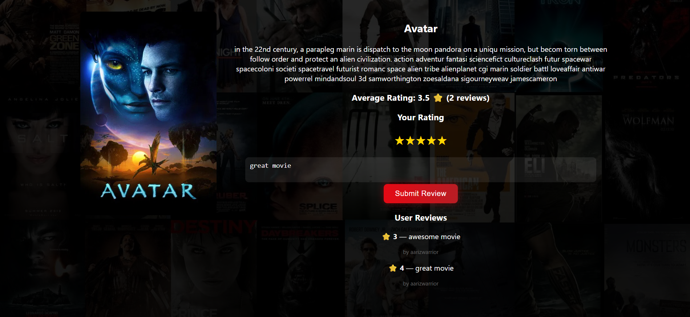
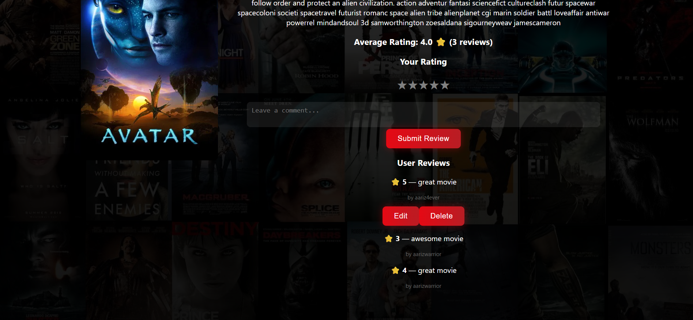

# 📽️ Movie Review & Recommendation Website

A full-stack web application that allows users to **search movies**, **view details**, **submit reviews**, and also get **movie recommendations** using a similarity matrix.

This project includes:

* **User authentication**
* **Add/Edit/Delete reviews**
* **Dynamic average star ratings**
* **TMDB-style movie UI**
* **Content-based recommendation system**

---

## 🚀 Tech Stack Used

### **Frontend**

* React.js (Vite)
* React Router DOM
* Context API (Authentication)
* CSS (Custom)

### **Backend**

* Node.js + Express.js
* MongoDB + Mongoose
* JWT Authentication
* CORS, dotenv

### **Machine Learning / Data**

* Pre-computed similarity matrix (cosine similarity)

---

## 🔧 Setup Instructions (Important!)

### **1️⃣ Clone the Repository**

```sh
git clone https://github.com/Aariz4ever/Movie-Review-and-Recommendation-Website.git
cd Movie-Review-and-Recommendation-Website
```

---

## 📁 2️⃣ Extract the Similarity Data (MANDATORY)

The similarity matrix is stored as a ZIP file due to GitHub’s file-size limits.

### **Steps:**

1. Go to:

```
client/src/data/similarity.zip
```

2. **Extract** it.
3. After extracting, place the file:

```
similarity.json → client/src/data/similarity.json
```

⚠️ *The app will NOT work unless this file is extracted and placed correctly.*

---

## 🖥️ 3️⃣ Setup Backend

```sh
cd server
npm install
npm start
```

Server runs on:

```
http://localhost:5000
```

---

## 🌐 4️⃣ Setup Frontend

```sh
cd client
npm install
npm run dev
```

Frontend runs on:

```
http://localhost:5173
```

---

## 🔐 Default User Credentials (If Provided)

If your evaluator needs credentials, add a sample like:

```
username: testuser
password: 123456
```

(or remove this section if unnecessary)

---

## ⭐ Key Features Implemented

### ✅ User Authentication

* Login & Register system (JWT)
* Protected review operations

### ✅ Movie Search & Display

* Displays movies dynamically
* Responsive grid layout

### ✅ Movie Details Page

* Movie overview
* Star-based rating UI
* User reviews section

### ✅ Add / Edit / Delete Reviews

* Only logged-in users can post
* Users can edit & delete their own reviews

### ✅ Dynamic Average Rating

* Shows real-time average rating per movie

### ✅ Recommendation System

* Uses a similarity matrix to show related movies
* Accuracy depends on extracted JSON file

### ✅ Modern UI

* Clean layout
* TMDB-like card design
* Fully responsive

---

## 🖼️ Screenshots

### 🔹 Login Page



### 🔹 Home Page



### 🔹 Detail Section



### 🔹 Posting Review



---
